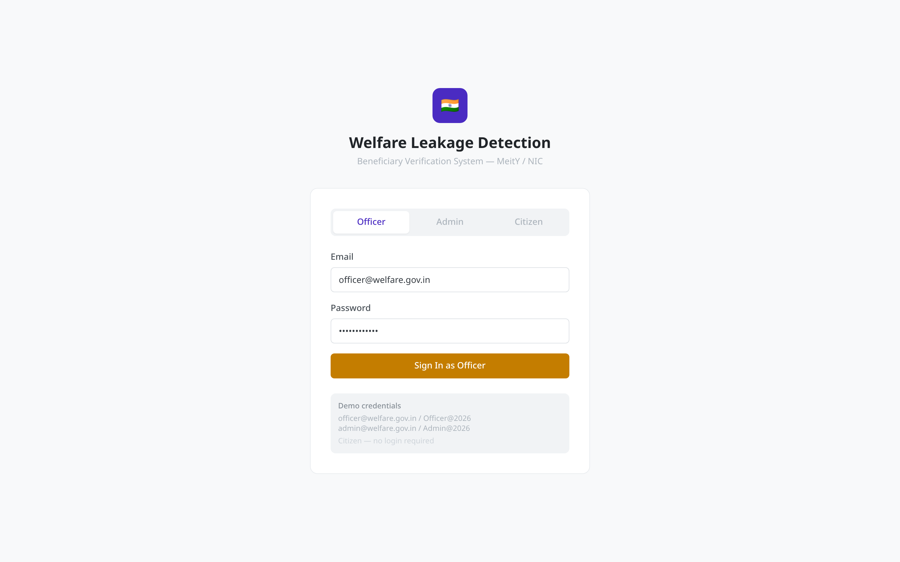
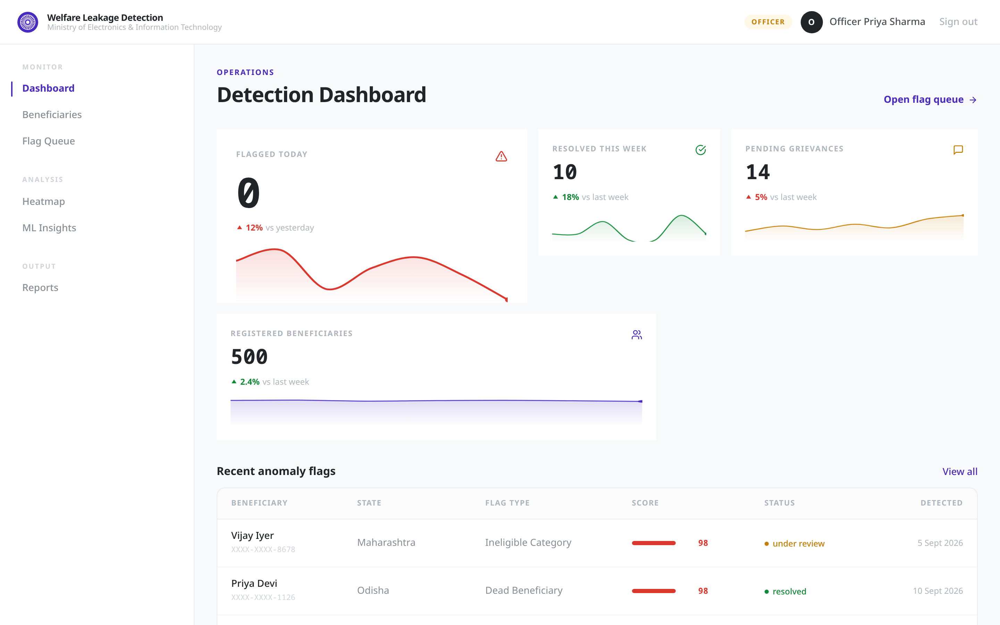
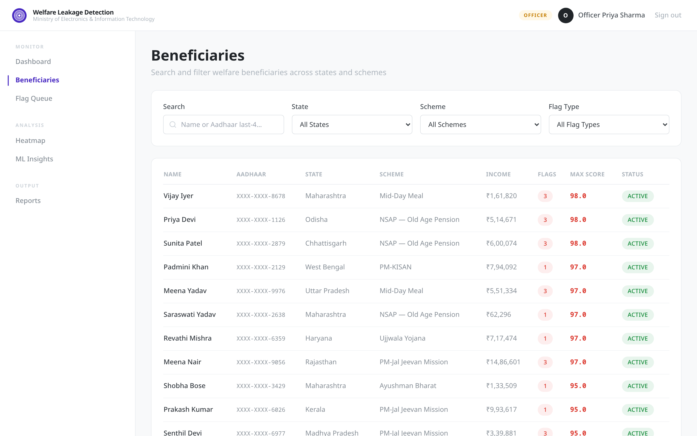
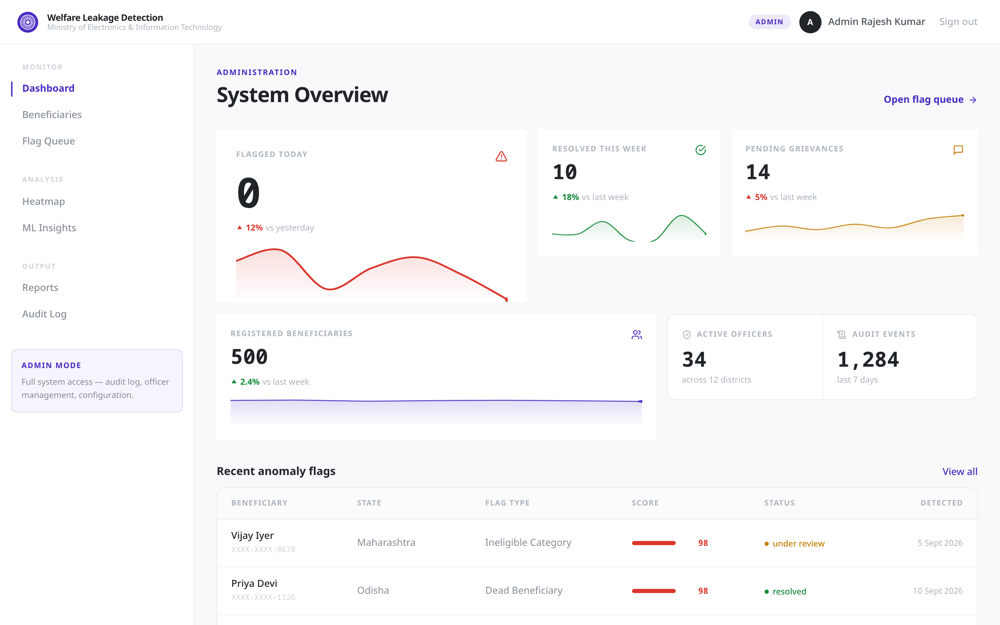
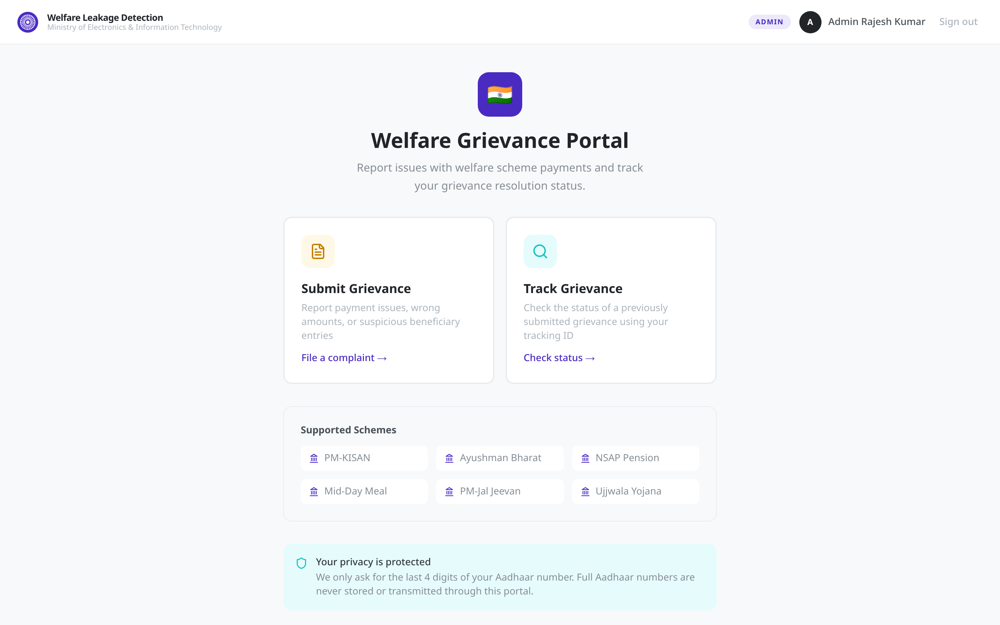

# Welfare Leakage Detection — AI Beneficiary Verification System

**PS Code:** SIH26202 · **Track:** Smart Automation (Software) · **Target:** MeitY / NIC — replicable for any Welfare Ministry
**Status:** Working full-stack prototype (36-hour hackathon build) · Mock data only — no real Aadhaar/DBT API access

---

## 📌 Problem Statement

India disburses **₹52+ lakh crore annually** through Direct Benefit Transfer (DBT) across dozens of
welfare schemes (PM-KISAN, Ayushman Bharat, NSAP pensions, Mid-Day Meal, etc.). A persistent
challenge is **leakage** — funds reaching people who should not receive them:

| Leakage type | Example |
|---|---|
| Ghost beneficiaries | Dead persons still drawing pensions |
| Duplicate identities | One Aadhaar linked to multiple DBT accounts |
| Ineligible recipients | Income-tax payees or government employees claiming BPL benefits |
| Geo anomalies | Credentials used in a different state than the registered address |
| Collusion patterns | Same mobile/bank seed shared across unrelated beneficiaries |

**Manual verification does not scale.** Existing systems flag anomalies but give officers no
explainable reasoning, no structured review workflow, no SLA tracking — and give citizens no
channel to report problems.

### Our solution

An end-to-end system that closes the loop across three roles:

```
  ML scoring ──────► Officer review queue ──────► Resolution + audit trail
  (anomaly           (explainable flags,          (confirm / resolve, SLA,
   detection)         SLA, Kanban workflow)         immutable audit log)
                              ▲
                              │ grievance channel
                        Citizen portal
                  (report issues, track status)
```

1. **ML service** scores every beneficiary record (Isolation Forest — mocked with
   pre-computed scores for the prototype) and produces *explainable* flag reasons.
2. **Officer/Admin portal** surfaces KPIs, searchable beneficiary records, anomaly gauges,
   a Kanban flag queue with SLA chips, state-wise leak heatmap, and ML model insights.
3. **Citizen portal** lets anyone submit a grievance (Aadhaar last-4 only) and track it
   through a status timeline — creating a feedback loop back into the detection pipeline.

Every officer action is **audit-logged**, every API endpoint enforces **server-side RBAC**,
and **full Aadhaar numbers never appear anywhere** — only last-4, masked at the API layer.

---

## 🖼️ Screenshots (by user role & function)

### Public — Sign-in / role selection


### Officer — Detection Dashboard (KPI cards, sparklines, anomaly flags)


### Officer — Beneficiary search (filters, scores, masked Aadhaar)


### Admin — System Overview (admin-only KPIs, Audit Log nav, admin mode)


### Citizen — Grievance portal (submit / track, no account needed)


---

## 👥 Roles & Full Feature List

### A. Officer Portal (`/officer`) — internal, JWT + RBAC

| # | Feature | Description |
|---|---------|-------------|
| 1 | **Login** | Role-based sign-in (Officer/Admin), RS256 JWT with 15-min access + 7-day rotating refresh tokens |
| 2 | **Detection Dashboard** | Asymmetric KPI grid: Flagged Today (hero), Resolved This Week, Pending Grievances, Registered Beneficiaries — each with count-up animation, direction-aware trend deltas, and drawn area sparklines |
| 3 | **Recent Anomaly Flags** | Live table with mini score-bars, dot status indicators, masked Aadhaar (`XXXX-XXXX-1234`) |
| 4 | **Beneficiary Search** | Full-text search (name / Aadhaar last-4) + filters (State, Scheme, Flag Type), server-side pagination, sort by anomaly score |
| 5 | **Beneficiary Detail** | Radial **anomaly score gauge** (0–100 with color zones), explainable flag reasons (feature contribution bars), DBT transaction history with UTR numbers, active flags with SLA chips |
| 6 | **Flag Queue (Kanban)** | 3 columns (Under Review → Confirmed → Resolved), drag-and-drop, card selection, **bulk actions**, per-card SLA countdown chips |
| 7 | **Anomaly Heatmap** | State-wise leak density — switchable metric (Leak Rate / Flag Count / Avg Score), ranked horizontal bar-map with criticality legend |
| 8 | **ML Model Insights** | Precision / Recall / F1 / AUC metric tiles, feature-importance chart, recent detection log, methodology panel |
| 9 | **Reports & Export** | Date-range picker, CSV export (streams from API), report-type catalog |
| 10 | **Beneficiary Detail** | Profile (gender, DOB, category, income, bank seed), flags, audit — see #5 |

### B. Admin Portal (`/officer`, role=admin) — everything above, plus:

| # | Feature | Description |
|---|---------|-------------|
| 1 | **Differentiated dashboard** | Title switches to *System Overview*, eyebrow *Administration* |
| 2 | **Admin-only KPIs** | Active Officers (34 across 12 districts), Audit Events (1,284 / 7 days) |
| 3 | **Audit Log** | Immutable trail of every officer action — who flagged/resolved what, when, from which IP (admin-only nav + `requireRole('admin')` API) |
| 4 | **Admin mode indicator** | Sidebar card + purple ADMIN pill in header |
| 5 | **User management scope** | RBAC `*` permission — full API surface |

### C. Citizen Portal (`/citizen`) — public, OTP (mocked), no account

| # | Feature | Description |
|---|---------|-------------|
| 1 | **Grievance form (4-step)** | Details → Documents → OTP Verify → Confirm, with progress stepper |
| 2 | **Aadhaar last-4 only** | 4-digit input; full Aadhaar never requested or stored (privacy notice inline) |
| 3 | **Scheme & issue-type pickers** | 6 schemes, 5 issue types (not received, wrong amount, deceased claim, duplicate, other) |
| 4 | **Document upload** | Multi-file, PDF/JPG/PNG, 5 MB cap, client-side validation with removable file list |
| 5 | **OTP verification (mocked)** | Send + 30s resend cooldown; demo code `123456` |
| 6 | **Review & submit** | Summary before submit → returns tracking ID (`GRV-2026-XXXXX`) |
| 7 | **Grievance tracker** | Tracking ID + Aadhaar last-4 lookup → vertical timeline (Submitted → Under Review → Resolved) with status tags and SLA estimate |

---

## 🛡️ Security Model

Full details in [`SECURITY.md`](SECURITY.md). Highlights — all **enforced server-side**:

- **RBAC on every endpoint** — `requireAuth` → `requireRole` → `requirePermission` middleware chain; hidden UI is never the control
- **RS256 JWT** — asymmetric key pair (generated, in `.env`, never committed); 15-min access tokens, 7-day **rotating** refresh tokens with jti revocation
- **bcrypt (cost 12)** for officer/admin passwords; citizens are OTP-only
- **Aadhaar masking at API layer** — handlers return last-4 only; full numbers never stored, logged, or shipped to the browser
- **Zod validation** on every request body/query (injection + malformed-input defense)
- **Rate limiting** — global 200/min, auth 10/min, grievance **3/hour** per IP
- **Helmet CSP + HSTS**, strict CORS allowlist, `frame-ancestors 'none'`
- **Audit logging** — every officer action (view, flag, resolve, export, failed login) appended with actor, IP, user-agent
- **OWASP Top 10 posture** — see `SECURITY.md` §9 for the mapped mitigation table

---

## 🧪 Mock vs Real (honest matrix)

| Component | Status |
|---|---|
| Auth (JWT, rotation, RBAC, rate limit) | ✅ **Real** |
| Input validation (Zod), audit logging | ✅ **Real** |
| Aadhaar last-4 masking at API | ✅ **Real** |
| CSV export | ✅ **Real** (streams from API) |
| Beneficiary/flag/DBT data (500 / 240 / ~2.5k records) | 🔁 **Mock fixtures** (deterministic, seeded) |
| ML anomaly scores | 🔁 **Pre-computed** — Isolation Forest logic documented, scores baked into fixtures |
| Aadhaar verification | 🔁 Mock (`XXXX` last-4 accepted) |
| OTP | 🔁 Fixed `123456`, logged server-side |
| Persistence | 🔁 **In-memory** (Postgres/Mongo/Redis schema designed & documented in `PROJECT.md`, not wired) |
| External GoI APIs (UIDAI/PFMS/NPCI) | 🔁 Never called — simulated only |

---

## 🚀 Quick Start

```bash
git clone https://github.com/varun-pahuja/SIH-PROTO.git
cd SIH-PROTO/welfare-leakage
npm install

# Terminal 1 — API (port 3000)
cd apps/api && npm run dev

# Terminal 2 — Web (port 5173, proxies /api → :3000)
cd apps/web && npm run dev
```

Open **http://localhost:5173**

### Demo credentials

| Role | Email | Password |
|---|---|---|
| Officer | `officer@welfare.gov.in` | `Officer@2026` |
| Admin | `admin@welfare.gov.in` | `Admin@2026` |
| Citizen | — no login — | click **Sign in → Citizen** |
| OTP (mocked) | — | `123456` |

---

## 🔌 API Surface (summary)

Base URL `http://localhost:3000/api` — full contract in [`PROJECT.md`](PROJECT.md) §6

| Group | Endpoints |
|---|---|
| **Auth** | `POST /auth/login` · `POST /auth/refresh` · `POST /auth/logout` · `GET /auth/me` |
| **Officer** (RBAC) | `GET /officer/dashboard` · `GET /officer/beneficiaries[/:id]` · `GET /officer/flags` · `PATCH /officer/flags/:id` · `POST /officer/flags/bulk` · `GET /officer/heatmap` · `GET /officer/ml-insights` · `GET /officer/audit` *(admin)* · `GET /officer/reports/export` |
| **Citizen** (public) | `POST /citizen/grievance` · `GET /citizen/grievance?trackingId=&aadhaarLast4=` |
| **Health** | `GET /health` |

---

## 🎨 Design System

Government-appropriate, **UX4G 3.0** palette — implemented as Tailwind theme tokens, not defaults:

| Token | Hex | Use |
|---|---|---|
| Brand Purple | `#4A2BC2` | Identity, active nav, links |
| Saffron | `#C47D00` | Primary CTAs, focus rings |
| India Green | `#128937` | Success / resolved |
| Danger Red | `#DB372D` | Critical anomalies, errors |
| Info Cyan | `#13C2C2` | Medium severity, info |

- **Typography:** Noto Sans (body) + JetBrains Mono (all figures — scores, Aadhaar, currency)
- **Layout:** 12-col grid, 24px gutter, 1440px max — asymmetric KPI composition, never 4-equal-cards
- **Motion:** native CSS keyframes + rAF count-ups (zero animation deps) — all gated by `prefers-reduced-motion`
- **Accessibility:** WCAG 2.1 AA / GIGW-aligned — skip link, visible focus rings, ARIA labels, semantic tables, 4.5:1 contrast
- Full spec: [`DESIGN.md`](DESIGN.md)

---

## 🏗️ Tech Stack (and why)

| Layer | Choice | Rationale |
|---|---|---|
| Frontend | **React 18 + Vite + TypeScript + Tailwind** | Fast iteration; shared types; UX4G tokens as theme |
| Charts | **Recharts** (KPI sparklines) + **custom SVG** (gauge, heatmap) | Declarative where it's quick; bespoke where defaults look generic |
| Backend | **Node.js + Express + TypeScript** | Single language across stack; middleware chain maps 1:1 to security layers (helmet → rate-limit → auth → validate → controller) |
| Auth | **JWT (RS256) + bcryptjs** | Stateless, short-lived, rotation-ready |
| Validation | **Zod** | One schema language, precise errors |
| Data | **In-memory fixtures** (500 beneficiaries, 240 flags) | Schema & ER model documented for Postgres/Mongo in `PROJECT.md` §7; wiring deferred past the demo |
| ML | **Isolation Forest** *(pre-computed)* | Scores + explanations baked into fixtures; methodology documented in-app (ML Insights page) |

---

## 📂 Project Structure

```
SIH-PROTO/
├── README.md                  ← you are here
├── DESIGN.md                  ← UX4G design system spec
├── PROJECT.md                 ← scope, architecture, API contract, data model
├── SECURITY.md                ← threat model, trust boundaries, OWASP mapping
├── screenshots/               ← role/function-classified UI captures
└── welfare-leakage/
    ├── apps/
    │   ├── api/               ← Express + TS (port 3000)
    │   │   └── src/
    │   │       ├── config/      env, JWT keys
    │   │       ├── middleware/  auth, RBAC, validate, rate-limit, audit
    │   │       ├── routes/      auth, officer, citizen, validation
    │   │       ├── fixtures/    seeded 500-beneficiary dataset + flags
    │   │       └── utils/       RS256 JWT signing/verify
    │   └── web/               ← React + Vite (port 5173)
    │       └── src/
    │           ├── design/      tokens, globals.css (motion, focus)
    │           ├── components/  ui/ · shared/ · officer/ · citizen/
    │           ├── layouts/     OfficerLayout (admin-aware nav) · CitizenLayout
    │           ├── pages/       officer/ · citizen/ · LoginPage
    │           ├── hooks/       useAuth (single-flight refresh) · useCountUp
    │           └── utils/       api client (JWT interceptors) · formatters
    └── .env.example           ← copy to .env (JWT keys generated)
```

---

## 📚 Additional Documentation

| Doc | Contents |
|---|---|
| [`PROJECT.md`](PROJECT.md) | Product scope, two-role architecture, full API surface, Postgres/Mongo schemas, build phases, demo script |
| [`SECURITY.md`](SECURITY.md) | Data-flow diagram & trust zones, JWT design, RBAC matrix, Aadhaar handling, OWASP Top 10 status, hackathon trade-offs |
| [`DESIGN.md`](DESIGN.md) | UX4G token system, typography scale, component inventory, anti-pattern rules, a11y baseline |
| [`screenshots/README.md`](screenshots/README.md) | Screenshot classification (role × function) |

---

## 🔭 Known Limitations / Roadmap

- **In-memory persistence** — restart clears grievances + refresh tokens; swap in Postgres/Mongo (schemas ready)
- **ML is pre-computed** — wire a live scikit-learn service behind `/officer/ml-insights`
- **MFA not wired** — TOTP scaffold ready, not enabled for the demo
- **PDF export** — CSV ships; PDF listed in UI, generation deferred
- **Real UIDAI/DBT integration** — by design excluded; mock adapters documented for replacement

---

*Built for Smart India Hackathon 2026 · Prototype with synthetic data — not for production use with real Aadhaar data.*
